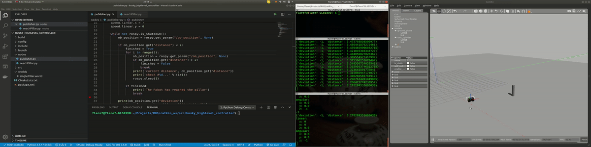

## **husky_laserscan**: 

**Launch files**:
- reachObject.launch : 
>launch a *gazebo* simulation of a world with a single block acting as a destination for the robot.
Husky's goal is to get closed to the block until it reaches a minimum distance and stops.

## Usage:
```
 roslaunch husky_laserscan reachObject.launch
```


**Scripts**:
- laserScanManage.py:
> Read the laser sensor from the `/scan` topic and extract the distance to the closest object and its orientation relative to the robot
It publishs an `Entity` message to the `/laser` topic 
### usage
```
 rosrun simple_husky_control laserScanManage.py 
```

- reachDestination.py:
> Subscribes to the `/laser` topic and send commands to the motor i.e sending a `Twist` message to the `cmd_vel` topic.
The node stops when it reaches a minimum distance.
 
### usage
```
 rosrun simple_husky_control reachDestination.py 
```

## <u>Note: </u>
You can move the block while the robot is moving and you can see how it's changing path.

<p align="center">

</p>